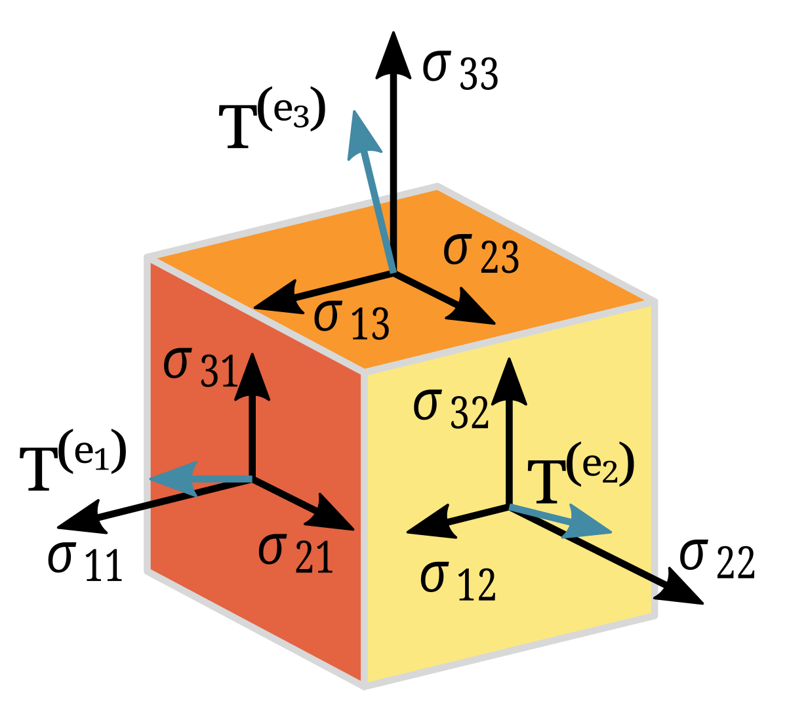

# Tensor Benchmarking



Read the report [here]([github.com/intelligent-username/Tensor-Benchmarks/report.pdf](https://github.com/intelligent-username/Tensor-Benchmarks/blob/main/report.pdf))

Which framework (implementation) is most efficient for doing tensor arithmetic? This project explores that question through unit testing. Many features have been implemented to "even-out the playing field" (i.e. the C program would be faster since C is a compiled language, so that is controlled for, or Vanilla Python would be faster than the libraries for smaller operations due to overhead, which is also (mostly) controlled for). The goal is to specifically test the speed of mathematical operations.

## Table of Contents

- [Tensor Benchmarking](#tensor-benchmarking)
  - [Table of Contents](#table-of-contents)
  - [Implementations](#implementations)
  - [Benchmarked Operations](#benchmarked-operations)
  - [Prerequisites](#prerequisites)
    - [1. Python 3.8+](#1-python-38)
    - [2. C Compiler](#2-c-compiler)
    - [3. Python Libraries](#3-python-libraries)
  - [Installation](#installation)
    - [Create a Virtual Environment](#create-a-virtual-environment)
    - [Activate the Virtual Environment](#activate-the-virtual-environment)
    - [Install Dependencies](#install-dependencies)
    - [Build the C Implementation](#build-the-c-implementation)
  - [Quick Start](#quick-start)
  - [Usage Examples](#usage-examples)
    - [Run Individual Implementations](#run-individual-implementations)
      - [C](#c)
      - [NumPy](#numpy)
      - [PyTorch](#pytorch)
      - [Vanilla Python](#vanilla-python)
    - [Run Centralized Benchmark Suite](#run-centralized-benchmark-suite)
  - [Configuration](#configuration)
  - [File Structure](#file-structure)
  - [Benchmark Format](#benchmark-format)
  - [Results and Visualization](#results-and-visualization)
    - [Results Summary](#results-summary)
    - [Visualization Instructions](#visualization-instructions)
  - [Notes](#notes)
  - [Troubleshooting](#troubleshooting)
  - [License](#license)

## Implementations

Here are the four approaches we're putting to the test:

1. **C** - A custom tensor library built with manual memory management
2. **NumPy** - Python's go-to numerical computing library
3. **PyTorch** - The deep learning framework that's become an industry standard
4. **Vanilla Python** - Pure Python tensor operations using built-in lists

## Benchmarked Operations

- **ADD**: Element-wise tensor addition
- **MM**: Matrix multiplication (2D)
- **BMM**: Batched matrix multiplication (3D)
- **SCAL**: Scalar multiplication
- **DOT**: Vector dot product (1D)

## Prerequisites

### 1. Python 3.8+

Our core language for most implementations. Here's how to install it on different systems:

**Windows:**

- Visit <https://www.python.org/downloads/>
- Download the latest Python 3.8+ installer
- During installation, **make sure to check "Add Python to PATH"**

**macOS:**

- Visit <https://www.python.org/downloads/> and download the macOS installer, OR
- Use Homebrew: `brew install python`

**Linux (Ubuntu/Debian):**

```bash
sudo apt update
sudo apt install python3 python3-pip python3-venv
```

**Linux (CentOS/RHEL/Fedora):**

```bash
sudo dnf install python3 python3-pip python3-venv  # Fedora/CentOS 8+
```

OR

```bash
sudo yum install python3 python3-pip python3-venv  # CentOS 7/RHEL
```

**Verify Python installation:**

```bash
python3 --version
```

### 2. C Compiler

Required for compiling our custom C tensor implementation.

**Windows:**
You have several options:

*Option A - MinGW (Recommended):*

- Download from <https://www.mingw-w64.org/downloads/>
- Choose the latest version (e.g., MinGW-W64 GCC)
- Install and add to your system PATH
- Test: `gcc --version`

*Option B - Visual Studio Build Tools:*

- Download Visual Studio Community (free) from <https://visualstudio.microsoft.com/>
- During installation, select "Desktop development with C++" workload
- Use Developer Command Prompt for compilation

*Option C - WSL (if you have Windows Subsystem for Linux):*

- Follow the Linux instructions below in your WSL environment

**macOS:**

```bash
# Install Xcode Command Line Tools
xcode-select --install

# Verify installation
gcc --version
```

**Linux (Ubuntu/Debian):**

```bash
sudo apt update
sudo apt install build-essential gcc
```

**Linux (CentOS/RHEL/Fedora):**

```bash
sudo dnf groupinstall "Development Tools"  # Fedora/CentOS 8+
# OR
sudo yum groupinstall "Development Tools"  # CentOS 7/RHEL
```

**Verify C compiler installation:**

```bash
gcc --version
```

### 3. Python Libraries

The required Python packages are listed in `requirements.txt`. We'll install these in a virtual environment during the ``Installation`` step to keep things organized and avoid conflicts with your system Python.

## Installation

### Create a Virtual Environment

```bash
python3 -m venv venv
```

### Activate the Virtual Environment

> **Important:** The way you activate your virtual environment depends on your operating system and where the environment was created. If you use WSL (Linux) and Windows interchangeably, make sure to activate the venv in the correct environment. A venv created in WSL will not work in Windows PowerShell, and vice versa.

- **On Windows (PowerShell):**

  ```powershell
  .\venv\Scripts\Activate.ps1
  ```

- **On Windows (Command Prompt):**

  ```cmd
  .\venv\Scripts\activate.bat
  ```

- **On WSL/Linux/macOS:**

  ```bash
  source venv/bin/activate
  ```

If you created your venv in WSL, always activate it from a WSL terminal. If you created it in Windows, activate it from PowerShell or Command Prompt. Mixing environments will cause errors and missing activation scripts.

### Install Dependencies

```bash
pip install -r requirements.txt
```

### Build the C Implementation

```bash
cd src
gcc tensors.c -std=c99 -O2 -Wall -Wextra -o tensors -lm
```

## Quick Start

Once installation is complete, you can run benchmarks immediately:

```bash
# Quick test with reduced warmup
BENCH_WARMUPS=1 python3 src/testrunner.py
```

Results are saved to `benchmarks/bench_report.json`.

## Usage Examples

### Run Individual Implementations

**Demo modes (show results):**
For each test, make sure you first navigate to the `src` folder.

```bash
cd src
```

#### C

Advantage: Pre-compiled & simple code.

```bash
gcc tensors.c -std=c99 -O2 -Wall -Wextra -o tensors -lm
./tensors
```

#### NumPy

The standard for doing math in Python.

```bash
python nptensors.py
```

#### PyTorch

Made for deep learning but has tensor operations built-in.

```bash
python pttensors.py
```

#### Vanilla Python

```bash
python tensors.py
```

**Benchmark modes (JSON timing output):**

```bash
# Create a simple test case
echo "OP ADD
A SHAPE 2 3 3 DATA 1 2 3 4 5 6 7 8 9
B SHAPE 2 3 3 DATA 9 8 7 6 5 4 3 2 1" > simple_test.txt

# Run benchmarks
cd src
./tensors --bench ../benchmarks/simple_test.txt
python3 nptensors.py --bench ../benchmarks/simple_test.txt
python3 pttensors.py --bench ../benchmarks/simple_test.txt
python3 tensors.py --bench ../benchmarks/simple_test.txt
```

### Run Centralized Benchmark Suite

```bash
# Quick test with reduced warmup (runs now default to 200 for stability)
BENCH_WARMUPS=1 python3 src/testrunner.py

# Override runs if needed (minimum enforced to 200)
BENCH_RUNS=100 BENCH_WARMUPS=3 python3 src/testrunner.py
```

## Configuration

Here are the key environment variables to adjust:

- `BENCH_RUNS=N` - Controls how many timing iterations we run per test. More runs mean more accurate results, but they'll take longer to complete.
- `BENCH_WARMUPS=N` - Sets the number of warmup runs before we start timing. This helps stabilize results by letting caches and JIT optimizations settle in.
- `VANILLA_SKIP_OVERLARGE=1` - Skips extremely large test cases for the Vanilla Python implementation to avoid waiting hours for results.
- `C_SKIP_EXPENSIVE=1` - Skips computationally intensive test cases for the C implementation.
- Most Importantly, a virtual environment for consistent Python dependencies

Feel free to change these controls in order to modify the parameters of the tests (i.e. higher `BENCH_RUNS`, for example, would lead to more accurate results).

## File Structure

- `src/` - All source code files
  - `tensors.c` + `test_cases.h` - C implementation with test data
  - `nptensors.py` - NumPy implementation
  - `pttensors.py` - PyTorch implementation
  - `tensors.py` - Vanilla Python implementation
  - `testrunner.py` - Centralized benchmark coordinator
  - `results.py` - Visualization and reporting script
- `benchmarks/` - Benchmark data and results
  - `bench_tests.txt` - Large test suite (21 test cases, ranging from easy to large-scale computations)
  - `bench_report.json` - Generated benchmark results
- `results/` - Generated plots and tables (bar/, box/, table/)
- `requirements.txt` - Python dependencies
- `README.md` - This documentation

## Benchmark Format

Test cases use a simple tagged format:

```md
OP <operation_name>
A SHAPE <ndim> <dim1> <dim2> ... DATA <val1> <val2> ...
B SHAPE <ndim> <dim1> <dim2> ... DATA <val1> <val2> ...
# or for scalar ops:
SCALAR <value>
```

## Results and Visualization

### Results Summary

From quick testing (3 runs each):

- **C**: Fastest (1-2μs), but limited precision in timing
- **Vanilla Python**: Often competitive for small operations
- **NumPy**: 2-7μs, good balance of speed and features
- **PyTorch**: 5-25μs, higher overhead but GPU-capable

Overall, for most simple, large-scale easy operations, C tends to perform the best. For more complex operations, NumPy is usually superior with PyTorch sometimes outperforming it. Vanilla Python is competitive at simpler tasks but falls behind on larger ones. For more details, see the [report](report.pdf)

### Visualization Instructions

After running benchmarks, plots and tables will be generated automatically. To re-generate them (in a vacuum), run the `results.py` script:

```bash
python3 src/results.py
```

This creates a comprehensive set of visualizations:

- **Bar plots** comparing median execution times across operations and implementations
- **Box plots** showing the distribution and variability of timing results
- **Aggregate tables** in both CSV and Markdown formats for further analysis

Everything gets saved in `results/bar/`, `results/box/`, and `results/table/`. Just make sure matplotlib and pandas are available (they're included in `requirements.txt`).

## Notes

- All implementations use `time.perf_counter()` for consistent timing
- C uses `clock()` for portability
- PyTorch includes CUDA synchronization barriers when using GPU
- Results include median, mean, standard deviation, min/max times
- Some tests are skipped due to sheer size (C & Vanilla Python implementations aren't optimized for them, no point spending hours waiting)

## Troubleshooting

Running into issues? Here are some common problems and their solutions:

- **Venv activation fails**: Double-check you're using the right activation command for your environment. Remember, a venv created in WSL won't work in Windows PowerShell, and vice versa.
- **Missing dependencies**: After activating your venv, run `pip install -r requirements.txt`. If that doesn't work, try upgrading pip first with `pip install --upgrade pip`.
- **C compilation errors**: Ensure GCC is installed on your system. On Windows, you might need MinGW or WSL. Make sure you're running the compilation command from the `src/` directory.
- **Python version issues**: Verify you have Python 3.8 or higher with `python3 --version`. Some features require this minimum version.
- **Benchmark runs too slow**: Speed things up by reducing iterations with `BENCH_RUNS=50`, or skip large test cases with `VANILLA_SKIP_OVERLARGE=1` and `C_SKIP_EXPENSIVE=1`.
- **Plots not generating**: Check that matplotlib is installed and try running `python3 src/results.py` after your benchmarks complete.
- **Permission errors**: On Windows, try running your terminal as administrator. On Linux/macOS, you might need `sudo` for certain operations.

## License

This project is licensed under the MIT License - see the [LICENSE](LICENSE) file for details.
